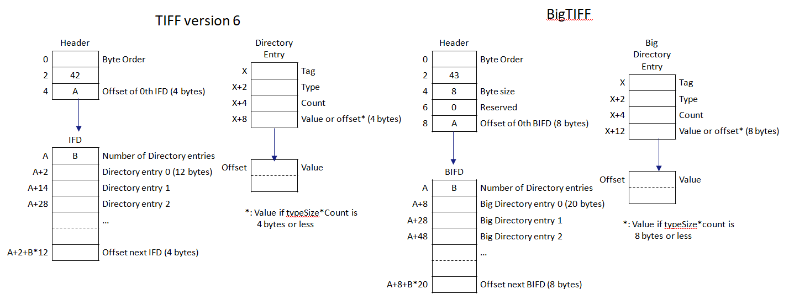

[appendix]
[[annex-classic-tiff-basic-struct-informative]]
:appendix-caption: Annex
== Classic TIFF v6 basic data structures and complete list of BigTIFF data types (Informative)

=== Image File Header
For comparison purposes, we reproduce the original TIFF version 6 TIFF header here.

[#classic-tiff-file-header,reftext='{table-caption} {counter:table-num}']
.Classic TIFF file header (informative)
[width = "100%",options="header"]
|===
| Offset | Datatype | Value
| 0 | uint16 | Byte order indication
| 2 | uint16 | Version number (always 42)
| 4	| uint32 | Offset to first IFD
|===

=== Image File Directory
For comparison purposes, we reproduce the original TIFF version 6 Image File Directory here.

[#classic-ifd,reftext='{table-caption} {counter:table-num}']
.Classic IFD (informative)
[width = "100%",options="header"]
|===
| Offset | Datatype | Value
| 0 | uint16 | Number of tags in IFD (B)
| 2+0*12 | Tag structure | First tag data
| 2+1*12 | Tag structure | Second tag data
...
| 2+(B-1)*12 | Tag structure | Last tag data
| 2+B*12 | uint32 | Offset to next IFD, if there is a next IFD or 0 otherwise
|===

Every tag takes up exactly 12 bytes in classic TIFF, and looks like this:
[#classic-tag-structure,reftext='{table-caption} {counter:table-num}']
.Classic Tag structure (informative)
[width = "100%",options="header"]
|===
| Offset | Datatype | Value
| 0 | uint16 | Tag identifying code
| 2 | uint16 | Datatype of tag data
| 4 | uint32 | Number of values
| 8 | x * Tag data datatype or uint32 offset | Tag data or offset to tag data
|===

In classic TIFF, the tag data was written inside the tag structure, in the IFD, if its size was smaller than or equal to 4 bytes. Otherwise, it's written elsewhere, and pointed to.

[#img_TIFFandBigTIFFstructure,reftext='{figure-caption} {counter:figure-num}']
.TIFF and BigTIFF data structures side by side.

=== Datatype Tag values

The following table summarizes the Tag datatypes aplicable for BigTIFF. This list includes "Types" described in the TIFF version 6 specification, as well as some extra types that have been defined by the BigTIFF (this Standard).

[#datatype-values,reftext='{table-caption} {counter:table-num}']
.BigTIFF Datatype Tag values
[width = "100%",options="header", cols="10,15,~,~"]
|===
| Value {set:cellbgcolor:#EEEEEE} | Name | Description | Source
| 1 {set:cellbgcolor:#FFFFFF} | BYTE (uint8) | 8-bit unsigned integer | TIFF specification
| 2 | ASCII | 8-bit byte that contains a 7-bit ASCII code; the last byte SHALL be a NUL character (binary zero) | TIFF specification
| 3 | SHORT (uint16) |  16-bit (2-byte) unsigned integer | TIFF specification
| 4 | LONG (uint32) | 32-bit (4-byte) unsigned integer | TIFF specification
| 5 | RATIONAL | Two LONGs: the first represents the numerator of a fraction; the second, the denominator | TIFF specification
| 6 | SBYTE | An 8-bit signed (twos-complement) integer | TIFF version 6
| 7 | UNDEFINED | An 8-bit byte that may contain anything, depending on the definition of the field ^a^ | TIFF version 6
| 8 | SSHORT (int16) | A 16-bit (2-byte) signed (twos-complement) integer | TIFF version 6
| 9 | SLONG (int32) | A 32-bit (4-byte) signed (twos-complement) integer. | TIFF version 6
| 10 | SRATIONAL | Two SLONGs:  the first represents the numerator of a fraction, the second the denominator | TIFF version 6
| 11 | FLOAT | Single precision (4-byte) IEEE format | TIFF version 6
| 12 | DOUBLE | Double precision (8-byte) IEEE format | TIFF version 6
| 13 | IFD | A uint32 IFD offset | TIFF PageMaker version 6
| 16^b^ | LONG8 (uint64) | 64-bit (8-byte) unsigned integer | BigTIFF
| 17 | SLONG8 (int64) | 64-bit (8-byte) signed integer | BigTIFF
| 18 | IFD8 | A uint64 IFD offset | BigTIFF
4+| ^a^ It can be used to store a complicated data structure in a single private field, The Count will be the number of bytes required to hold the data structure.

^b^ numbers 14 and 15 have   no meaning.
|===
